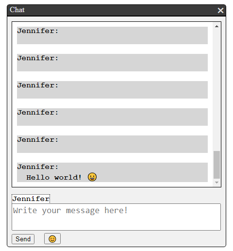

# &lt;chat-app&gt;

A web component representing a chat window where you chat with a random student.

## Methods

### `get username()`

Get the name of the current chatter.

### `set username(newName)`

Set the name of the current chatter.

## WebSocket Configuration

This project communicates with a WebSocket server for real time updates.

### WebSocket Server Address

The WebSocket connections are established with the following server address:

`wss://courselab.lnu.se/message-app/socket`

## Example

The top bar in the image is not included in this component.

