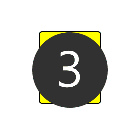

# &lt;flipping-tile&gt;

A web component representing a tile that is flippable.

## Attributes

`flipped`

An attribute representing if the tile is flipped or not with the front side showing.

Default value: undefined.

`inactive`

An attribute that indicates that the tile is inactive.

Default value: undefined.

`disabled`

An attribute that completely disables the tile making it 'disappear' but still occupying the space it takes.

Default value: undefined.

## Custom Events

| Event Name | Fired When |
|------------|------------|
|`tileFlipped`|Attribute is set as `flipped`|
|`disabledTile`|Attribute is set to `disabled`|

## Methods

### `flip()`

Flips the tile around, changing what side is shown.

## Customization

### Background Color and Background Image

#### - Using CSS

You can customize the background color and image of the flipped tile using the `::part(back)` and `::part(front)` pseudo element.
The following CSS can be applied to your custom element:

```css
flipping-tile::part(back) {
    background-color: #your-color;
    background-image: url("./your-image-url");
}
```

#### - Using HTML

You can customize your tile images on the front side using `slot="frontImage"` in your HTML.
The following HTML can be applied to you custom element:

```html
<flipping-tile>
 
</flipping-tile>
```

## Examples


from left to right:
1. Backside of tile, default.
2. Flipped, frontside of the tile showing.
3. disabled.
4. inactive.



Example of the flip method.